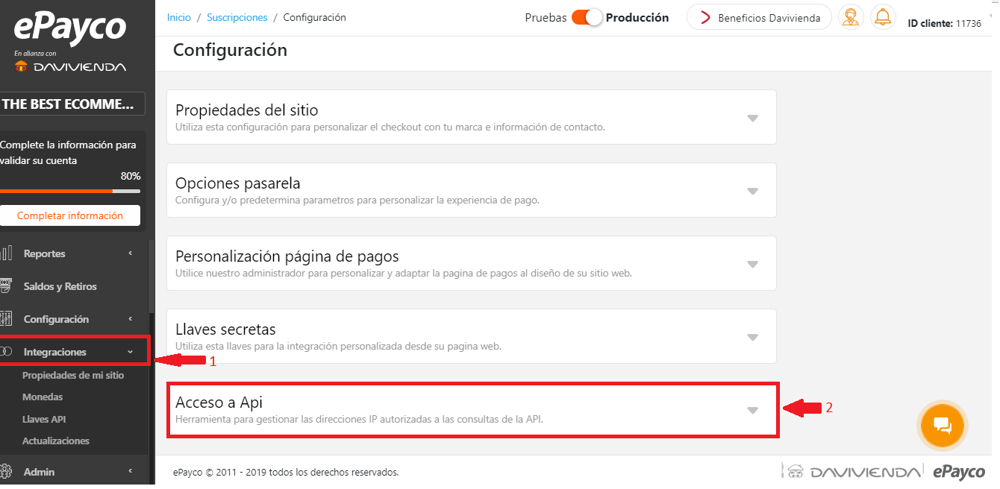
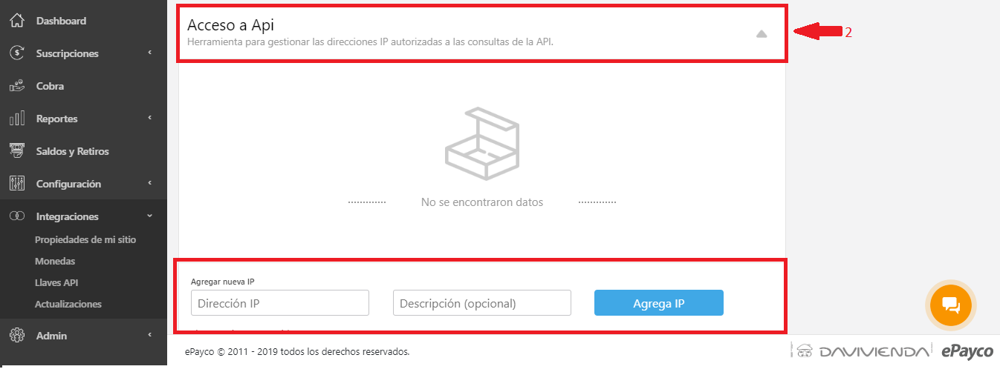

# Web service

This documentation provides the information necessary for the connection and use of the Rest web service to consult movements and transactions, such as the input parameters, the response of the service and the error codes that are handled in it.

## Authentication

For authentication in REST the public key \(public\_key\) corresponds to the merchant that is making the request must be sent. This key must be sent as a parameter in the body to carry out each of the requests.

## Security

#### IP Restricted

IP restrictions are made to guarantee that the data will not be sent from any computer or domain.

To add the IPs that need to be authorized, you must:

1.  In the [Dashboard](https://dashboard.epayco.co/login) we click on "Integraciones"



**2.** Then in the API ACCESS tab the addresses are added, edited or deleted



#### Supported programming languages.

The clients that REST allows can be written in Java or in .NET, PHP, IOS, JAVASCRIPT.

## Available methods

#### Transaction query

`URL: "https://apiservices.epayco.co/consulta/transaccion"`

In this option you must send the desired parameters to consult, in case of not sending any date range the service will return the transactions made the month immediately prior to the current date.

| `Field` | Required | Description | Example |
| :--- | :--- | :--- | :--- |
| public\_key | Yes | public key of commerce | 491d6a0b6e992cf924edd8 |
| refPayco | No | Unique internal reference of the gateway that identifies the transaction | 513889 |
| descripcion | No | Payment description | Dress  |
| Autorizacion | No | Transaction authorization code. | 000000 |
| Recibo | No | Transaction receipt number | 48771515454803 |
| Estado | No | Transaction status [View status](https://docs.epayco.co/payments/checkout#scroll-cod-response) | Accepted |
| email | No |  Payment customer email  | user@example.com |
| docPagador | No | Paying customer document number | 12345678 |
| fechaInicioTransaccionInicial | No |  start date of the range of the transaction \(YYYY-MM-DD-hh-mm-ss\) | 2020-01-01-12-00-00 |
| fechaFinTransaccionInicial | No | end date of the range of the transaction\(YYYY-MM-DD-hh-mm-ss\) | 2020-01-30-23-59-59 |
| fechaInicioPagoTransaccion | No | start date of the range of the transaction \(payment\) \(YYYY-MM-DD-hh-mm-ss\) | 2020-01-01-12-00-00 |
| fechaFinPagoTransaccion | No | End date of the range of the transaction \(payment\) \(YYYY-MM-DD-hh-mm-ss\) | 2020-01-30-23-59-59 |
| extra1 | No | Text extra1 | Info extra 1 |
| extra2 | No | Textextra2 | Info extra 2 |
| extra3 | No | Text extra3 | Info extra 3 |
| resultadosPagina | No |  desired results per page \(default 50\) | 10 |
| página | No | page to consulting | 1 |

#### Request Example

```text
{
  "public_key":"491d6a0b6e992cf924edd8d3d088aff1",
  "refPayco":"",
  "refCliente":"",
  "descripcion":"",
  "autorizacion":"",
  "recibo":"",
  "email":"",
  "docPagador":"",
  "fechaInicioTransaccionInicial":"2018-01-01-00-01-03",
  "fechaFinTransaccionInicial":"2018-01-01-00-12-03",
  "fechaInicioPagoTransaccion":"",
  "fechaFinPagoTransaccion":"",
  "resultadosPagina":"",
  "pagina":"",
  "extra1":"",
  "extra2":"",
  "extra3":""
}   
```

#### Response Example

| Campo | Descripción | Tipo |
| :--- | :--- | :--- |
| success | Bool type variable that indicates whether the process was successful or unsuccessful. | bool |
| title\_response | Title response | text |
| text\_response | Text response | text |
| last\_action | Last action | text |
| data |  Array with data. | array |

```text
{
   "success": true,
   "title_response": "Consulta realizada",
   "text_response": "Consulta realizada exitosamente",
   "last_action": "informacion_consultada",
   "data": {
       "current_page": 1,
       "data": [], 
   "from": 1,
   "last_page": 4,
   "next_page_url": "https://apiservices.epayco.co/consulta/transaccion?pagina=2",
   "path": "https://apiservices.epayco.co/consulta/transaccion",
   "per_page": 50,
   "prev_page_url": null,
   "to": 50,
   "total": 156   
} 
```

#### Query movements

`URL: "https://apiservices.epayco.co/consulta/movimiento"`

In this option you must send the desired parameters to consult, in case of not sending any date range the service will return the movements made in the month immediately prior to the current date.


| Campo | Requerido | Descripción | Ejemplo |
| :--- | :--- | :--- | :--- |
| public\_key | Si | Public key of commerce | 491d6a0b6e992cf924edd8d3d088aff1 |
| refPayco | No | Unique internal reference of the gateway that identifies the transaction | 513889 |
| fechaInicio | No | `Start date of movements` \(date of realization\) \(yyyy-mm-dd\) | 2018-01-15 |
| fechaFin | No |  End date of movement \(date of realization\) \(yyyy-mm-dd\) | 2018-01-30 |
| resultadosPagina | No |  desired results per page \(default 50\) | 10 |
| pagina | No | page of consulting | 1 |

**Body:**

```text
{
    "public_key":"491d6a0b6e992cf924edd8d3d088aff1",
    "refPayco": "",
    "fechaInicio": "",
    "fechaFin": "",
    "tipoMovimiento": "",
    "resultadosPagina": "",
    "pagina": ""
}      
```

**Response of consulting**

| Campo | Descripción | Tipo |
| :--- | :--- | :--- |
| success | Bool type variable that indicates whether the process was successful or unsuccessful. | bool |
| title\_response | Title response | text |
| text\_response | Text response | text |
| last\_action | Last action | text |
| data |  Array with data. | array |

```text
{
    "success": true,
    "title_response": "Consulta realizada",
    "text_response": "Consulta realizada exitosamente",
    "last_action": "informacion_consultada",
    "data": {
          "current_page": 1,
          "data": [],
          "from": null,
          "last_page": 0,
          "next_page_url": null,
          "path": "https://apiservices.epayco.co/consulta/movimiento",
          "per_page": 50,
          "prev_page_url": null,
          "to": null,
          "total": 0
    }
} 
```

