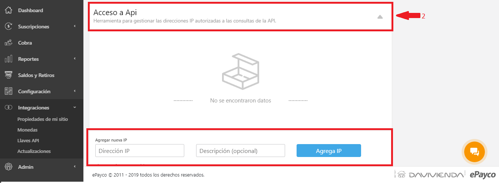

# Web service

Esta documentación proporciona la información necesaria para la conexión y el uso del servicio web Rest para consultar movimientos y transacciones, como los parámetros de entrada, la respuesta del servicio y los códigos de error que se manejan en él

## Autenticación

 Para la autenticación en el REST se debe enviar la llave pública \(`public_key`\) que corresponde al comercio que está realizando la petición. Esta llave debe ser enviada por parámetro en el body para llevar a cabo cada una de las peticiones.

## Seguridad

#### Restricción por Ip

 se realizan restricciones por ip para garantizar que los datos no van a ser enviados desde cualquier equipo o dominio.

 **Para añadir las IP que se requieran autorizar se debe:**

 **1.** En el [Dashboard](https://dashboard.epayco.co/login) damos clic en "Integraciones"


 **2.** Luego en la pestaña ACCESO API se agregan, editan o eliminan las direcciones



#### Lenguajes de programación soportados.

 Los clientes que permite el REST pueden ser escritos en Java o en .NET, PHP, IOS, JAVASCRIPT.

## Métodos disponibles

#### Consulta de transacciones

`URL: "https://apiservices.epayco.co/consulta/transaccion"`  
 En esta opción se debe de enviar los parámetros deseados para consultar, en caso de no enviar ningún rango de fechas el servicio retornará las transacciones realizadas el mes inmediatamente anterior a la fecha actual.

| Campo | Requerido | Descripción | Ejemplo |
| :--- | :--- | :--- | :--- |
| public\_key | Si | Llave pública del comercio | 491d6a0b6e992cf924edd8d3d088aff1 |
| refPayco | No | Referencia única interna de la pasarela que identifica la transacción | 513889 |
| descripcion | No | Descripción del cobro | Vestido Mujer Primavera |
| Autorizacion | No | Código de autorización de la transacción. | 000000 |
| Recibo | No | Número de recibo de la transacción | 48771515454803 |
| Estado | No | Estado de la transacción [Ver estados](https://docs.epayco.co/payments/checkout#scroll-cod-response) | Aceptada |
| email | No |  Email del cliente pagador | usuario@ejemplo.com |
| docPagador | No | Número de documento del cliente pagador | 12345678 |
| fechaInicioTransaccionInicial | No |  Fecha de inicio del rango de la\(s\) transaccion\(es\) \(fecha de realización\) \(YYYY-MM-DD-hh-mm-ss\) | 2020-01-01-12-00-00 |
| fechaFinTransaccionInicial | No | Fecha final del rango de la\(s\) transaccion\(es\) \(YYYY-MM-DD-hh-mm-ss\) | 2020-01-30-23-59-59 |
| fechaInicioPagoTransaccion | No | Fecha de inicio del rango de la\(s\) transacción\(es\) \(fecha de Pago\) \(YYYY-MM-DD-hh-mm-ss\) | 2020-01-01-12-00-00 |
| fechaFinPagoTransaccion\) | No | Fecha final del rango de la\(s\) transaccion\(es\) \(YYYY-MM-DD-hh-mm-ss\) | 2020-01-30-23-59-59 |
| extra1 | No | Texto del extra1 | Info extra 1 |
| extra2 | No | Texto del extra2 | Info extra 2 |
| extra3 | No | Texto del extra3 | Info extra 3 |
| resultadosPagina | No |  Cantidad de resultados deseados por página \(predefinido 50\) | 10 |
| página | No | Pagina a consultar | 1 |

**Ejemplo de solicitud de consulta de transacciones:**

```text
{
  "public_key":"491d6a0b6e992cf924edd8d3d088aff1",
  "refPayco":"",
  "refCliente":"",
  "descripcion":"",
  "autorizacion":"",
  "recibo":"",
  "email":"",
  "docPagador":"",
  "fechaInicioTransaccionInicial":"2018-01-01-00-01-03",
  "fechaFinTransaccionInicial":"2018-01-01-00-12-03",
  "fechaInicioPagoTransaccion":"",
  "fechaFinPagoTransaccion":"",
  "resultadosPagina":"",
  "pagina":"",
  "extra1":"",
  "extra2":"",
  "extra3":""
}        
```

#### Ejemplo de respuesta de consulta de transacción

| Campo | Descripción | Tipo |
| :--- | :--- | :--- |
| success |  Variable tipo Bool que indica si el proceso fue exitoso o fallido. | bool |
| title\_response | Titulo de la respuesta | text |
| text\_response | Descripción de la respuesta | text |
| last\_action |  Ultima acción ejecutada en el servidor antes de dar la respuesta | text |
| data |  Array con los datos de consulta, paginación, longitud de datos. | array |

```text
{
   "success": true,
   "title_response": "Consulta realizada",
   "text_response": "Consulta realizada exitosamente",
   "last_action": "informacion_consultada",
   "data": {
       "current_page": 1,
       "data": [], 
   "from": 1,
   "last_page": 4,
   "next_page_url": "https://apiservices.epayco.co/consulta/transaccion?pagina=2",
   "path": "https://apiservices.epayco.co/consulta/transaccion",
   "per_page": 50,
   "prev_page_url": null,
   "to": 50,
   "total": 156   
} 
```

#### Consulta de movimientos

`URL: "https://apiservices.epayco.co/consulta/movimiento"`  
 En esta opción se debe de enviar los parámetros desados para consultar, en caso de no enviar ningún rango de fechas el servicio retornará los movimientos realizados el mes inmediatamente anterior a la fecha actual.

| Campo | Requerido | Descripción | Ejemplo |
| :--- | :--- | :--- | :--- |
| public\_key | Si | Llave pública del comercio | 491d6a0b6e992cf924edd8d3d088aff1 |
| refPayco | No | Referencia única interna de la pasarela que identifica la transacción | 513889 |
| fechaInicio | No | Fecha de inicio del rango de movimiento \(fecha de realización\) \(yyyy-mm-dd\) | 2018-01-15 |
| fechaFin | No |  Fecha final del rango de movimiento \(fecha de realización\) \(yyyy-mm-dd\) | 2018-01-30 |
| resultadosPagina | No |  Cantidad de resultados deseados por página \(predefinido 50\) | 10 |
| pagina | No | Pagina a consultar | 1 |

**Body:**

```text
{
    "public_key":"491d6a0b6e992cf924edd8d3d088aff1",
    "refPayco": "",
    "fechaInicio": "",
    "fechaFin": "",
    "tipoMovimiento": "",
    "resultadosPagina": "",
    "pagina": ""
}        
```

####  Respuesta Consulta Movimientos <a id="scroll-answer-query-transactions"></a>

| Campo | Descripción | Tipo |
| :--- | :--- | :--- |
| success | Variable tipo Bool que indica si el proceso fue exitoso o fallido. | bool |
| title\_response | Titulo de la respuesta | text |
| text\_response | Descripción de la respuesta | text |
| last\_action |  Ultima acción ejecutada en el servidor antes de dar la respuesta | text |
| data |  Array con los datos de consulta, paginación, longitud de datos | array |

**Ejemplo Respuesta de la petición:**

```text
{
    "success": true,
    "title_response": "Consulta realizada",
    "text_response": "Consulta realizada exitosamente",
    "last_action": "informacion_consultada",
    "data": {
          "current_page": 1,
          "data": [],
          "from": null,
          "last_page": 0,
          "next_page_url": null,
          "path": "https://apiservices.epayco.co/consulta/movimiento",
          "per_page": 50,
          "prev_page_url": null,
          "to": null,
          "total": 0
    }
} 
```

